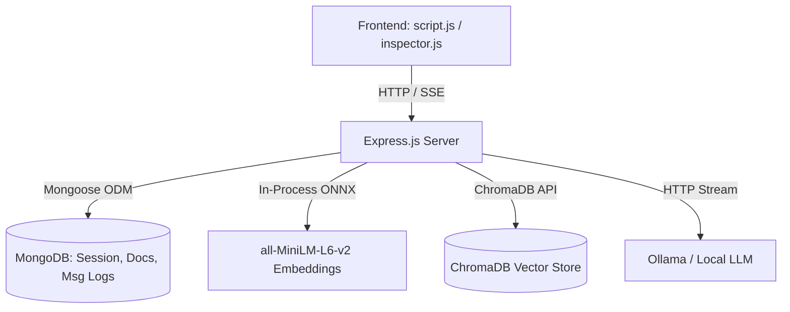

# 🤖 RAG Chatbot With a Pipeline Inspector

An advanced Retrieval-Augmented Generation (RAG) system with hybrid document chunking, in-process embedding models, session-persistent chat storage, and a deep-observability pipeline inspector sandbox.

---

## 🔬 Core System Architecture



### 💻 Frontend
- **Main Chat Interface**: Modern dashboard featuring sliding window chat history, real-time Server-Sent Events (SSE) streaming responses, and interactive, collapsible source citation blocks.
- **Pipeline Inspector (`inspector.html`)**: An isolated testing sandbox allowing developers to upload PDFs, trace ingestion stages step-by-step, inspect raw parsed text, and run isolated document-bound QA.
- **Vector Chunk Inspector (`debug.html`)**: A diagnostic dashboard for listing and viewing raw database vector entries, associated message IDs, and embedding vector dimensions.

### ⚙️ Backend
- **Node.js & Express.js**: Standardized REST API endpoints for chats, messages, document uploads, and diagnostic debugging.
- **MongoDB**: Keeps session persistence (Chat metadata, Mongoose schemas for `Messages` containing snapshot source arrays, and `Documents`).
- **ChromaDB**: The vector database containing dedicated collections (`notes_standard`, `notes_hierarchical`, and `inspector_chunks`) using Cosine similarity.
- **Local Embedding Engine**: Powered by `@xenova/transformers`. Downloads and runs the `all-MiniLM-L6-v2` embedding model (quantized for memory-efficiency) directly in the Node.js process—no external API keys or servers needed.

---

## 🚀 Key Features

### 1. Dual Chunking Strategies
- **Standard Chunker (Flat)**: Splits text into overlapping chunks of a configured size (e.g. 500 characters). Good for quick lookups.
- **Hierarchical Chunker (Parent-Child)**: 
  - Splits text into large **Parent Chunks** (e.g., 2000 characters) and indexes smaller **Child Chunks** (e.g., 400 characters) inside them.
  - Queries match the highly specific child chunks, but the system **expands the context** to the entire parent chunk before feeding it to the LLM. This provides high precision with broad, coherent context.

### 2. Layout-Aware PDF Parser
- Parses multi-column documents by sorting text components into rows and columns using spatial coordinate analysis (X/Y coordinates) from `pdfjs-dist`.
- Automatically filters out mathematical noise, references/bibliography sections (stopping ingestion past bibliography headers), and page headers/footers to keep context noise-free.

### 3. Session-Restored & Citation-Safe Chat
- Source chunks are snapshotted and persisted inside assistant `Message` schemas in MongoDB.
- Re-loading, renaming, or retrying a chat successfully hydates and displays references immediately without redundant database recalculations.
- Fallback lookups automatically reconstruct references for legacy messages using backward-compatible ChromaDB queries.

---

## 🛠️ Configuration & Environment Variables

Create a `.env` file in the root directory (based on `.env.example`):

```ini
# Server Port
PORT=3000

# MongoDB URI
MONGO_URI=mongodb://localhost:27017/rag-chatbot

# ChromaDB endpoint
CHROMA_URL=http://localhost:8000

# Provider configuration
CHAT_PROVIDER=ollama

# Ollama settings
OLLAMA_BASE_URL=http://localhost:11434
OLLAMA_CHAT_MODEL=qwen2.5:7b

# Ingestion Directories
UPLOAD_DIR=./uploads
DOCUMENT_DIR=./documents
```

---

## 📦 Detailed Setup & Launch Guide

### Prerequisites
- **Node.js** v18+ 
- **Docker & Docker Compose** (Recommended for MongoDB and ChromaDB)
- **Ollama** (For running LLMs locally)

### Step 1: Install Dependencies
```bash
npm install
```

### Step 2: Spin Up Databases (Docker Compose)
Make sure Docker is running and execute:
```bash
docker compose up -d
```
This spins up:
- **MongoDB** at `mongodb://localhost:27017/rag-chatbot`
- **ChromaDB** at `http://localhost:8000`

### Step 3: Run Ollama and Pull the Model
Start Ollama:
```bash
ollama serve
```
Download your preferred chat model (defaults to `qwen2.5:7b`):
```bash
ollama pull qwen2.5:7b
```

### Step 4: Ingest a Default Document (CLI)
You can ingest a baseline PDF directly into standard and hierarchical databases via:
```bash
node ingest.js --method hierarchical --file path/to/your/document.pdf
```

### Step 5: Start the Backend Server
```bash
# Production mode
npm start

# Development mode (auto-reloads on file changes)
npm run dev
```
Open `http://localhost:3000` in your web browser.

---

## 🔍 Understanding the RAG Pipeline Flow

### 📥 Ingestion Pipeline

```
[PDF Upload]
     │
     ▼
[Layout-Aware Parser] ──► Groups multi-column rows & detects bibliography cutoffs
     │
     ▼
[Text Cleaning] ────────► Filters out page numbers, citations, URLs, and math symbols
     │
     ▼
[Chunking strategy]
  ├─► Standard ─────────► Splits page-by-page into flat chunks
  └─► Hierarchical ─────► Creates parent chunks, splits into child sub-chunks
     │
     ▼
[Embedding Generation] ─► Generates 384-dimensional vectors via all-MiniLM-L6-v2
     │
     ▼
[Database Storage] ─────► Upserts chunks to ChromaDB and registers document in MongoDB
```

### 📤 Retrieval & Generation Pipeline

```
[User Query]
     │
     ▼
[Embedding Engine] ─────► Generates query vector representation
     │
     ▼
[Chroma Query] ─────────► Fetches nearest neighbor chunks (Cosine distance)
     │
     ▼
[Similarity Gate] ──────► Filters out matches below similarity threshold (e.g. < 0.35)
     │
     ▼
[Context Reconstruction]
  ├─► Standard ─────────► Uses retrieved chunks directly
  └─► Hierarchical ─────► Deduplicates and expands child chunks to parent text spans
     │
     ▼
[LLM Streaming Generation]
  ├─► Feeds system prompt, conversation history window, and context blocks to Ollama
  └─► Streams response tokens + persists citation sources array to MongoDB message logs
```
