# 🧠 Local Offline-First RAG Chatbot

An enterprise-grade, **100% offline, retrieval-augmented generation (RAG)** chatbot prototype. Built on a lightweight, decoupled Node.js and Vanilla JS stack, this application extracts knowledge from local PDF documents and generates answers locally using ChromaDB, ONNX-powered embeddings, and Ollama.

---

## 🚀 Key Features

*   **🔒 100% Offline Privacy**: Zero data egress. Embeddings, vector searches, database transactions, and LLM text generation occur entirely on your local machine.
*   **📄 Layout-Aware PDF Parser**: Grouping algorithms prevent multi-column layout text merging, ensuring clean vertical text flows from academic and industrial PDFs.
*   **🧬 Hierarchical Parent-Child Chunking**: Splits large parent context chunks (2000 chars) into small child vectors (400 chars) for high-precision semantic lookup, expanding back to parent context for rich LLM responses.
*   **⚖️ Similarity-Gated Hybrid Re-ranking**: Combines HNSW Cosine Similarity search (weighted 70%) with Keyword Token Overlap (weighted 30%), filtered through a hard similarity gate ($Cosine\ Similarity \ge 0.40$).
*   **⚡ Extractive Context Compression**: Sentence-level parsing trims down retrieved context to only sentences containing query terms, saving up to 40% of prompt context space.
*   **🛠️ RAG Pipeline Inspector Sandbox**: An interactive browser-based testing arena to upload test documents, view step-by-step processing logs via SSE, and test query runs.
*   **🛡️ Robust Security & Auth**: Password hashing with Bcrypt, access/refresh JWT cookie rotation, double-submit CSRF prevention, and built-in rate-limiting.

---

## 📐 System Architecture

The application splits computational workloads into two decoupled, asynchronous pipelines:

```mermaid
flowchart TD
    subgraph Ingestion_Pipeline ["Document Ingestion Pipeline"]
        A["PDF Upload via Multer"] --> B["pdfjs-dist Layout-Aware Parsing"]
        B --> C["Bibliography Truncation Filter"]
        C --> D["Regex Noise Cleaning"]
        D --> E{Chunking Strategy}
        E -->|Standard Chunking| F["Standard Split: 1000 Chars"]
        E -->|Hierarchical Chunking| G["Parent Chunks: 2000 Chars / Child Chunks: 400 Chars"]
        F --> H["@xenova/transformers Local Embedding"]
        G --> H
        H --> I[("ChromaDB: Document Collections")]
        I --> J["MongoDB: Update Document Status to Completed"]
    end

    subgraph Query_Generation_Engine ["Query-Retrieval-Generation Engine"]
        K["User Query Input"] --> L["MongoDB: Save Message"]
        L --> M["transformers: Embed Query"]
        M --> N[("Query ChromaDB Collections")]
        N -->|Document Collection Hits| O["Cosine Similarity Gate >= 0.40"]
        N -->|Conversation Memory Hits| P["Recall Historical Context"]
        O --> Q{Is Hierarchical?}
        Q -->|Yes| R["Map Child ID -> Fetch Metadata Parent Text"]
        Q -->|No| S["Deduplicate and Clean Chunks"]
        R --> T["Merge Context & Keyword Token Overlap Re-ranking"]
        S --> T
        P --> T
        T --> U["Extractive Sentence-Level Context Compression"]
        U --> V["Dynamic Prompt Construction"]
        V --> W["Ollama HTTP API Streaming Connection"]
        W --> X["Server-Sent Events SSE Response Stream"]
        X --> Y["MongoDB: Save Assistant Message & Cache Summary"]
        Y --> Z["Background: Memory Pipeline Turn Ingestion"]
    end
```



---

## 🏁 Quick Start Guide (How to Run Now)

If you have downloaded this project and want to run it immediately:

1.  **Start Services via Docker**: Make sure Docker is running, then start MongoDB and ChromaDB:
    ```bash
    docker-compose up -d
    ```
2.  **Pull the LLM Model**: Open Ollama and download the default model:
    ```bash
    ollama pull qwen2.5:7b
    ```
3.  **Install Node Modules**:
    ```bash
    npm install
    ```
4.  **Create `.env` Configuration**: Copy the template config:
    ```bash
    cp .env.example .env
    ```
5.  **Ingest Default Documents**: Load and embed files into ChromaDB:
    ```bash
    npm run ingest
    ```
6.  **Run the Server**: Start the local Node.js application:
    ```bash
    npm start
    ```
7.  **Access the Interface**: Open [http://localhost:3000](http://localhost:3000) in your web browser.

---

## 💻 Local Machine Environment Setup Guide

To implement or run this project on a brand new local computer, follow this setup guide for every required tool.

### 1. Install Node.js (Runtime Environment)
Node.js runs our backend server.
*   **Windows / macOS**: Download and run the **LTS installer** from [nodejs.org](https://nodejs.org/).
*   **Linux (Ubuntu/Debian)**:
    ```bash
    curl -fsSL https://deb.nodesource.com/setup_20.x | sudo -E bash -
    sudo apt-get install -y nodejs
    ```
*   **Verify installation**:
    ```bash
    node -v
    npm -v
    ```

### 2. Install Docker Desktop (Database Hosting)
Docker hosts ChromaDB and MongoDB, avoiding complex manual database installations.
*   **Windows / macOS**: Download **Docker Desktop** from [docker.com/products/docker-desktop](https://www.docker.com/products/docker-desktop/) and complete the setup wizard.
    > [!IMPORTANT]
    > **Windows Users**: Ensure WSL 2 (Windows Subsystem for Linux) is enabled in Docker Settings -> General.
*   **Linux**: Install Docker Engine and Docker Compose using your package manager.
*   **Verify installation**:
    ```bash
    docker --version
    docker-compose --version
    ```

### 3. Install Ollama (Local Large Language Model Engine)
Ollama runs the AI models locally, leveraging GPU acceleration if available.
*   **Windows**: Download and run the installer from [ollama.com/download/windows](https://ollama.com/download/windows).
*   **macOS**: Download and run the app from [ollama.com/download/mac](https://ollama.com/download/mac).
*   **Linux**: Run the official installation script:
    ```bash
    curl -fsSL https://ollama.ai/install.sh | sh
    ```
*   **Verify installation**:
    ```bash
    ollama --version
    ```

---

## 🛠️ Step-by-Step Implementation Guide (From Scratch)

Here is how you can recreate and implement this entire project folder by folder, file by file.

### Step 1: Initialize Project Directory & Structure
Create a fresh folder on your computer and generate the folder structure:
```bash
mkdir rag-chatbot
cd rag-chatbot
mkdir backend backend/config backend/controllers backend/db backend/middleware backend/models backend/routes backend/services backend/utils
mkdir frontend frontend/vendor
mkdir data documents
```

Initialize your Node.js project:
```bash
npm init -y
```

### Step 2: Install Core Dependencies
Install the required packages:
```bash
npm install express mongoose dotenv cors cookie-parser jsonwebtoken bcrypt multer axios pino pino-http pino-pretty uuid zod @xenova/transformers pdfjs-dist chromadb mongodb-memory-server express-rate-limit helmet
```

### Step 3: Write Configuration & Docker Files
1.  **`docker-compose.yml`**: Create this in your root folder to define database services:
    ```yaml
    services:
      mongodb:
        image: mongo:7
        container_name: rag-mongodb
        ports:
          - "27017:27017"
        volumes:
          - mongodb_data:/data/db
        restart: unless-stopped
      chromadb:
        image: chromadb/chroma:latest
        container_name: rag-chromadb
        ports:
          - "8000:8000"
        volumes:
          - chroma_data:/chroma/chroma
        environment:
          - IS_PERSISTENT=TRUE
          - ANONYMIZED_TELEMETRY=FALSE
        restart: unless-stopped
    volumes:
      mongodb_data:
      chroma_data:
    ```
2.  **`.env`**: Add project configuration keys (copy from `.env.example`).
3.  **`backend/config/index.js`**: Create a file to load environment variables using Zod validation.

### Step 4: Implement Database Integration
1.  **`backend/db/connection.js`**: Write logic to connect to MongoDB. If connection fails, trigger `mongodb-memory-server` to automatically spin up a lightweight, local MongoDB in-memory database instance.
2.  **Mongoose Models (`backend/models/`)**:
    *   `User.js`: Schema for users (hashed passwords, lockouts, verification tokens).
    *   `Chat.js`: Schema for chats (title, message preview count, pinned flags).
    *   `Message.js`: Schema for messages (associated chatId, role: user/assistant, source chunk IDs, similarity scores).
    *   `Document.js`: Schema for documents (original filename, filepath, chunk count, chunking method).

### Step 5: Implement Ingestion & Layout-Aware Parsing
1.  **`backend/services/ingestion.js`**:
    *   Use `pdfjs-dist` layout coordinates to detect column splits and order lines vertically.
    *   Write a regex truncation filter that stops parsing when headers like `References` or `Bibliography` are reached.
    *   Clean mathematical formulas and clean spacing.
    *   Provide chunking functions:
        *   *Standard*: 1000 characters with 200 character overlap.
        *   *Hierarchical*: Parent (2000 chars) split into overlapping child nodes (400 chars) holding their Parent ID and text.

### Step 6: Implement Local Embedding & Vector Store Logic
1.  **`backend/services/embeddingService.js`**:
    *   Initialize `@xenova/transformers` using the `Xenova/all-MiniLM-L6-v2` model.
    *   Write a function to generate embeddings locally using ONNX Runtime.
2.  **`backend/services/vectorService.js`**:
    *   Connect to the local ChromaDB server on port `8000`.
    *   Write functions to insert child text chunks, store parent texts as metadata, query nearest neighbors, and delete vectors by document ID.

### Step 7: Create the Retrieval & Re-ranking Core
1.  **`backend/services/retrieval.js`**:
    *   Query ChromaDB for top-10 nearest vectors.
    *   Convert Cosine distance back to Similarity: $\text{Similarity} = 1 - \text{Distance}$.
    *   Filter results through a gating threshold ($\ge 0.40$).
    *   For hierarchical results, expand child items back to their parent text.
    *   Calculate **Keyword Match Ratio** (token overlap) for each text.
    *   Calculate final rank score: $(0.7 \times \text{Similarity}) + (0.3 \times \text{Keyword Ratio})$.
    *   Apply sentence compression to trim sentences lacking query tokens.

### Step 8: Setup generation & streaming (SSE)
1.  **`backend/services/generation.js`**:
    *   Create prompt templates containing system instructions, historical message summaries, and retrieved context chunks.
    *   Connect to Ollama via `axios` with stream response settings.
    *   Relay generated stream tokens to the frontend client using Server-Sent Events (SSE).

### Step 9: Establish the Web Server
1.  **`backend/server.js`**: Setup Express server with security settings:
    ```javascript
    const express = require('express');
    const helmet = require('helmet');
    const cookieParser = require('cookie-parser');
    const cors = require('cors');

    const app = express();
    app.use(helmet());
    app.use(cors({ origin: true, credentials: true }));
    app.use(express.json());
    app.use(cookieParser());
    // Mount routes: /api/auth, /api/chats, /api/documents, etc.
    ```

### Step 10: Build UI Pages
Write your files in the `frontend/` folder:
1.  `index.html` & `script.js`: Main chat window featuring conversation lists, message sending, streaming SSE listeners, source citations, and settings.
2.  `inspector.html` & `inspector.js`: Sandbox terminal testing space for inspecting vector scores, page highlights, and parsing details.
3.  `style.css`: Clean, dark-mode modern design system.

---

## 🔍 Troubleshooting

*   **Ollama connection error (`ECONNREFUSED` or timeout)**: Ensure Ollama is running (`ollama serve`) and accessible at the host configured in your `.env` file (usually `http://127.0.0.1:11434`).
*   **MongoDB fails to connect**: If Docker isn't running, the system will automatically spin up `mongodb-memory-server` in RAM. Note: This will not persist data across system restarts. Run `docker-compose up -d` to enable database persistence.
*   **Embedding downloads fail**: The system downloads model weights from Hugging Face on the first execution. If your local firewall blocks this, download the model weights manually or allow inbound connections for the Node.js process.
