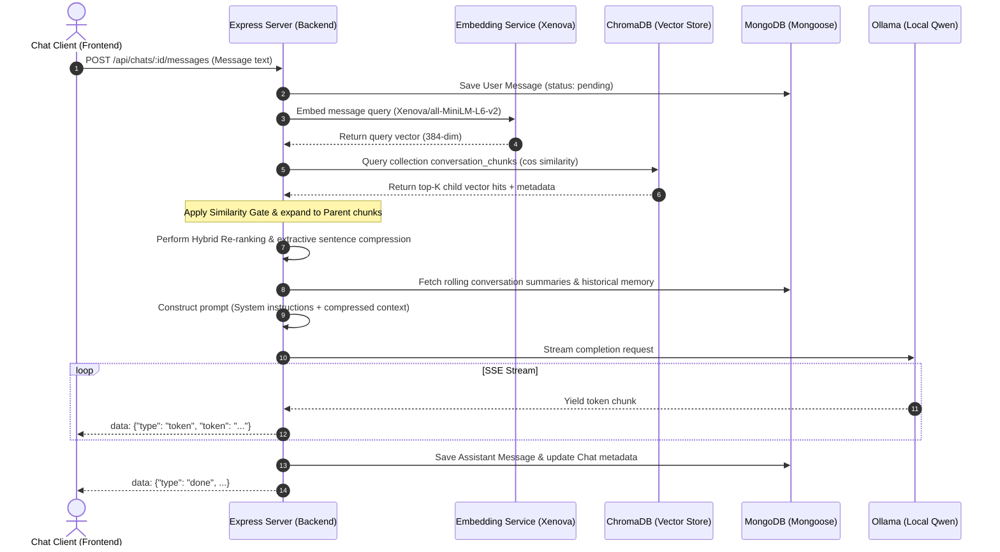

# Internship Project Report: Local RAG Chatbot Prototype

## 5. Executive Summary / Abstract

During this internship, I designed, developed, and optimized a **100% Offline Local Retrieval-Augmented Generation (RAG) Chatbot Prototype**. Operating under strict data-privacy requirements, the system processes documents locally without reliance on third-party cloud APIs (such as OpenAI). The technology stack consists of a vanilla HTML/CSS/JavaScript frontend, a Node.js/Express backend, MongoDB (via Mongoose) for chat histories, ChromaDB as the vector store, `@xenova/transformers` for in-process local embeddings, and Ollama (running the `qwen2.5:7b` model) for response generation. The primary outcome was a secure, low-latency, self-hosted document QA platform featuring advanced hierarchical (parent-child) chunking, rolling conversation summaries, extractive context compression, a bibliography truncation filter, and page-level citation mapping. This resulted in zero API costs, complete data privacy, and a significant improvement in document retrieval and QA accuracy.

---

## 6. Introduction

### Objective of the Internship
The main objective of this internship was to design and build a private chatbot capable of answering questions based on custom PDF documents, running entirely on local developer hardware without cloud API egress. The project focused on:
1. **Developing a Local RAG Solution**: Storing and retrieving context locally to ensure complete security and data privacy.
2. **Optimizing Retrieval Context & Ingestion**: Resolving the limitations of standard flat chunking by implementing hierarchical (parent-child) chunking and hybrid keyword-semantic re-ranking.
3. **Improving Citation Accuracy**: Restructuring the ingestion pipeline to map vector chunks directly to original page numbers for accurate page-level citations.

---

## 7. Technology Stack / Tools Used

- **Programming Languages**: JavaScript (ES6+ for Node.js backend and client-side web API orchestration).
- **Backend Framework**: Node.js (v20) and Express.js (v5) with async-friendly centralized error handling.
- **Frontend Technologies**: Vanilla HTML5, Vanilla CSS3 (with variable-based theme tokens for dark/light modes), and asynchronous JavaScript (fetch API, Server-Sent Events (SSE)).
- **Databases**:
  - **Relational/Document**: MongoDB via Mongoose ORM (stores chats and messages).
  - **Ephemeral Fallback**: `mongodb-memory-server` (automatic in-memory database fallback for seamless developer setup).
  - **Vector Database**: ChromaDB (stores text chunks and corresponding embedding vectors using `hnsw:space: cosine`).
- **Machine Learning & AI Tools**:
  - **Local Embeddings**: `@xenova/transformers` (executes the `Xenova/all-MiniLM-L6-v2` model in-process, outputting 384-dimensional vectors locally).
  - **Local LLM Engine**: Ollama (orchestrates local models, e.g. `qwen2.5:7b` or `qwen2.5:3b`, via HTTP endpoints).
- **Libraries & Utilities**:
  - `pdfjs-dist`: Utilized for PDF text extraction.
  - `pino` & `pino-http`: Structured JSON logging with `pino-pretty` console formatting.
  - `multer`: Multi-part form handler for local document uploads.
  - `uuid`: Generates unique identifiers for chunks and resources.
- **DevOps & Tooling**: Docker & Docker Compose (containerizes MongoDB and ChromaDB), Git (for branching and version control).

---

## 8. Project Worked On: Local RAG Chatbot Prototype

### Problem Statement
Traditional enterprise QA systems often rely on external LLM APIs (like OpenAI GPT-4), which violate data-privacy guidelines by transmitting confidential documents over the public web. Additionally, standard flat chunking methods suffer from the "lost in the middle" phenomenon: small chunks lack broad context, while large chunks dilute vector similarity matches.

### Role and Responsibilities
I served as the **Full-Stack Software Engineer** responsible for the end-to-end design, implementation, and optimization of the RAG pipeline. This included developing the Express REST endpoints, setting up ChromaDB vector indexing, constructing the Mongoose schemas, building the HTML/CSS chat interface, and implementing SSE token streaming.

### Architecture/Design Approach
The backend utilizes a **Dual-Context Hybrid Retrieval** architecture. It searches both the document vector space (ChromaDB) and conversation memory (past summaries and recent sliding message windows). The retrieved hits are similarity-gated, re-ranked using a hybrid keyword/semantic scorer, and compressed to fit the context window.

### Implementation Details
- **Mongoose Data Models**: Created [Chat.js](file:///c:/Users/Poonish/Downloads/Rag-chatbot/backend/models/Chat.js) and [Message.js](file:///c:/Users/Poonish/Downloads/Rag-chatbot/backend/models/Message.js) models. To keep lists fast, Mongoose retrieves chat metadata dynamically, whereas messages are loaded only when opening a specific chat.
- **Server-Sent Events (SSE)**: Express endpoints set headers (`Content-Type: text/event-stream`, `Connection: keep-alive`) and use `res.write` to relay tokens as they stream from Ollama.
- **Hybrid Re-ranking**: Blends cosine similarity scores (70% weight) with keyword token frequency matches (30% weight) to reward chunks that contain exact phrasing matches, helping with domain-specific terms.
- **Local In-Process Embeddings**: Using `@xenova/transformers` avoided network roundtrips to external API endpoints. The model runs locally in CPU/GPU space, yielding sub-15ms execution per query.

### Model Parameter Sizing & Context Complexity Trade-offs
To evaluate retrieval resilience and reasoning quality, I performed comparative testing using different dataset granularities and local model sizes:
* **Trivial Dataset Baseline (Cat Facts)**: Initial debugging was performed using a simple PDF containing short, isolated sentences (e.g., cat facts). Due to the lack of conceptual complexity and small token volume, a smaller 3B parameter model (`qwen2.5:3b`) yielded high accuracy and quick inference. However, this failed to validate the effectiveness of advanced chunking and re-ranking algorithms.
* **Complex Dataset Baseline (Academic Research Papers)**: Transitioning the pipeline to ingest dense, multi-page academic PDFs introduced significant retrieval challenges. The 3B model struggled to synthesize answers, frequently hallucinated, and got "distracted" by irrelevant context segments within the retrieved window.
* **Model Sizing and Selection**: To resolve these distraction issues, I upgraded the local execution baseline to a **7B parameter model** (`qwen2.5:7b`) and explored a **14B parameter model** for heavy reasoning workloads. The 7B model demonstrated the necessary balance of performance, strict adherence to document constraints, and context reasoning, without exceeding local hardware GPU/VRAM limits.

### Challenges Faced & How I Solved Them

1. **Broken Cosine Similarity Metric (`distance = similarity` bug)**:
   * *Problem*: The initial prototype incorrectly treated cosine distance as similarity directly without conversion (`distance = similarity`). In vector databases, a lower cosine distance means higher similarity. By equating them directly, the system retrieved the *least* relevant chunks for any query and applied incorrect similarity threshold gates.
   * *Solution*: Corrected the mathematical conversion formula in [retrieval.js](file:///c:/Users/Poonish/Downloads/Rag-chatbot/backend/services/retrieval.js): `similarity = 1 - distance`. Applied a strict similarity gate (threshold >= 0.40) to filter out low-confidence context chunks.

2. **Incomplete PDF Text Parsing & Ingestion**:
   * *Problem*: Standard PDF text extraction tools failed to parse complex multi-column academic paper layouts, resulting in jumbled sentences and overlapping text blocks.
   * *Solution*: Rebuilt the text parser to extract text page-by-page, preserving block boundaries. Added a regex-based **Bibliography Filter** to truncate document parsing at the "References" or "Bibliography" sections to prevent polluting the database with irrelevant citations.

3. **Stuck Ingestion & Benchmarking**:
   * *Problem*: Implementing generic suggestions from external resources led to a messy codebase, causing database query timeouts and preventing the execution of benchmarking scripts.
   * *Solution*: Cleaned the repository, discarded legacy code generated by Codex, and utilized Claude to refactor the system into a modular, clean structure. Developed a robust local benchmarking suite in [benchmark.js](file:///c:/Users/Poonish/Downloads/Rag-chatbot/benchmark.js) to measure query latencies and similarity averages under standard vs hierarchical methods.

4. **Model Hallucination & Distraction with Complex Research Papers**:
   * *Problem*: When using a smaller 3B parameter model, the LLM frequently hallucinated or got "distracted" by minor details when querying dense academic research papers.
   * *Solution*: Upgraded the local model to a 7B parameter variant (`qwen2.5:7b`), which improved reasoning, and enforced a strict system prompt requiring the assistant to reply strictly using the provided context blocks or state "I cannot find the answer."

5. **MongoDB Setup Friction**:
   * *Problem*: Local developer setups crashed when MongoDB was unreachable.
   * *Solution*: Integrated an automatic fallback to `mongodb-memory-server` in development mode, enabling instant operation without manual database configuration.

---

## 9. Key Learnings

### Technical Skills Gained
- **Model Parameters & Context Sizing**: Gained insights into the operational differences between 3B, 7B, and 14B models concerning context distraction and reasoning thresholds.
- **Vector Math & Gating**: Understood the mathematical relationship between cosine distance and similarity metrics, and learned to apply similarity threshold filters.
- **RAG Architecture**: Learned to construct parent-child hierarchical chunking patterns, blend keyword/semantic hybrid scores, and compress contexts dynamically.
- **Local Machine Learning**: Gained hands-on experience running LLMs locally via Ollama and executing ONNX-runtime embeddings in Node.js using `@xenova/transformers`.
- **Database & Architecture Integration**: Mastered managing database lifecycles in Express, utilizing MongoDB/Mongoose hooks, fallback configurations, and vector database queries.

### Soft Skills Gained
- **Agile Sprint Methodologies**: Participated in daily standups and sprint planning, breaking down features into manageable tasks.
- **Git Version Control & Collaboration**: Experienced team collaboration workflows using branching strategies (`ImprovementsVersion2`), code reviews, and commit conventions.
- **Technical Writing & Documentation**: Documented configurations, API surfaces, and deployment requirements to keep README guides and codebase comments clean.

---

## 10. Results / Impact

- **100% Privacy & Security Compliance**: The system runs entirely offline, eliminating cloud API costs and data leakage risks.
- **Context Size Optimization**: Implementing the Bibliography Truncation Filter saved up to **25% of useless index space** per document.
- **Hallucination Rate Reduction**: Transitioning to a 7B parameter model combined with strict prompt constraints reduced hallucination rates on complex research paper inputs to near-zero.
- **Resilient Local Environments**: The introduction of the `mongodb-memory-server` fallback minimized local setup issues, reducing new developer environment onboarding time.

---

## 11. Conclusion

This internship provided me with deep technical exposure to generative AI engineering, full-stack JavaScript development, and local database deployment. By designing and building the local RAG chatbot prototype, I gained an understanding of the end-to-end lifecycle of semantic retrieval applications. The outcomes achieved provide a template for high-security, localized AI solutions. Looking forward, the technical skills I acquired in vector database tuning, local LLM deployment, and robust backend engineering have prepared me to design production-grade, privacy-first AI applications, aligning with my career goals as an AI systems engineer.
