# Technical Architecture & Stack Deep Dive: Local RAG Chatbot

This document provides a comprehensive, in-depth analysis of the system architecture, design decisions, database schemas, core algorithms, security controls, and scaling characteristics of the offline-first Local Retrieval-Augmented Generation (RAG) Chatbot.

---

## 1. Architecture & Stack

### What is the full tech stack (languages, frameworks, databases, libraries) and why was each component chosen?

#### Languages
*   **JavaScript (ES6+)**: Chosen as the single, unifying language across the entire application. It runs on the backend (Node.js) and the frontend (Vanilla JS). This eliminates structural mismatches, simplifies JSON serialization/deserialization, and allows modular code structure using modern ES module dynamics (e.g., dynamic importing of `@xenova/transformers` and `pdfjs-dist` libraries).

#### Frameworks
*   **Backend: Express.js (v5.2.1)**: Express v5 was chosen for its native, async-friendly error handling. Async errors in route handlers are automatically propagated to the centralized error middleware without needing boilerplate wrappers like `express-async-errors`. It is highly lightweight and provides full control over HTTP headers and streaming.
*   **Frontend: Vanilla HTML5 / Vanilla CSS3 / Vanilla JS**: A conscious design decision was made to avoid frontend frameworks (like React, Vue, or Next.js) for the core chat interface. This keeps the application load times sub-second, prevents build pipeline overhead, eliminates compilation steps, and guarantees low-overhead rendering on developer laptops.

#### Databases & Vector Stores
*   **MongoDB (via Mongoose ORM v9.7.3)**: Used as the primary system-of-record for transactional data (Users, Chats, Messages, Summaries, and Documents). It was chosen for its schema flexibility, native support for nested documents, and easy indexing of chronological data.
*   **mongodb-memory-server (v11.2.0)**: Integrated as an automatic developer-mode fallback. If a local or containerized MongoDB database is unreachable, the application starts an in-process, ephemeral MongoDB server in RAM. This provides zero-friction developer onboarding.
*   **ChromaDB (v3.4.3)**: Serves as the vector database. It was chosen because it runs fully locally (offline, zero API costs, zero data egress), exposes a clean HTTP client library, utilizes Hierarchical Navigable Small World (HNSW) graphs, and supports customizable distance spaces (configured for Cosine distance).

#### Machine Learning & AI Tools
*   **Local Embeddings: @xenova/transformers (v2.0.1)**: Runs embedding inference directly inside the Node.js process using ONNX Runtime. It uses the `Xenova/all-MiniLM-L6-v2` model (quantized to 8-bit for CPU speed). This keeps embeddings fully local (no network calls) and executes queries in sub-15ms.
*   **Local LLM Engine: Ollama**: Orchestrates LLM loading, VRAM allocation, and CPU/GPU execution. It exposes a simple API on port 11434. The default model is `qwen2.5:7b` (selected for its excellent document context reasoning and strict rule-following).

#### Libraries & Utilities
*   **pdfjs-dist (v4.10.38)**: Used for layout-aware PDF text extraction.
*   **bcrypt (v5.1.1)**: Hashes user passwords with 12 salt rounds.
*   **jsonwebtoken (v9.0.2)**: Used for signing access tokens and refresh tokens.
*   **axios (v1.18.0)**: Handles HTTP requests to Ollama endpoints.
*   **pino & pino-http**: High-speed, structured JSON loggers.
*   **multer (v2.2.0)**: Middleware handling multipart form data for document uploads.

---

### Can you describe the high-level system architecture — how does data flow from user input to final output?

The application is structured around two distinct operational pipelines: **Document Ingestion** and **Query Retrieval-Generation**.

```mermaid
flowchart TD
    subgraph Ingestion_Pipeline ["Document Ingestion"]
        A["PDF File Upload"] --> B["pdfjs-dist: Layout-Aware Parsing"]
        B --> C["Bibliography Truncation Filter"]
        C --> D["Regex Text Cleaning"]
        D --> E{Chunking Method}
        E -->|Standard| F["Standard split: 1000 chars"]
        E -->|Hierarchical| G["Parent: 2000 chars / Child: 400 chars"]
        F --> H["@xenova/transformers: Embed Text"]
        G --> H
        H --> I[("ChromaDB: Vector Index")]
        I --> J["Update MongoDB Document: completed"]
    end

    subgraph Query_Streaming_Pipeline ["Query/Response Flow"]
        K["User Message input"] --> L["Save Message to MongoDB"]
        L --> M["Generate Query Vector"]
        M --> N[("Query ChromaDB")]
        N -->|Document Hits| O["Cosine Similarity Gate >= 0.40"]
        N -->|Memory Hits| P["Recall Past Conversation Context"]
        O --> Q{Is Hierarchical?}
        Q -->|Yes| R["Map Child Vector -> Expand Parent Chunk"]
        Q -->|No| S["Deduplicate by Text"]
        R --> T["Merge Hits & Apply Hybrid Re-Ranking"]
        S --> T
        P --> T
        T --> U["Extractive Sentence-Level Compression"]
        U --> V["Build Context Prompt"]
        V --> W["Fetch Message History Sliding Window"]
        W --> X["Ollama api/chat SSE Stream"]
        X --> Y["Stream Tokens to User via SSE"]
        Y --> Z["Save Assistant Message to MongoDB"]
        Z --> AA["Background: Index Turn & Summarize"]
    end
```



#### Detailed Ingestion Flow
1. The user uploads a PDF file through the frontend.
2. The server receives the file, creates a `Document` record in MongoDB, and sets the status to `processing`.
3. `loadPdfText` extracts characters and positions page-by-page. It groups text into rows (3px Y-coordinate tolerance), calculates the midpoint of the page, separates left and right columns, and sorts the lines vertically to handle multi-column academic paper layouts correctly.
4. A regex filter truncates parsing if it matches bibliography headers (e.g., `References` or `Bibliography`), saving up to 25% of useless index space.
5. Text is cleaned of noise (isolated formulas, citation brackets, etc.).
6. Text is chunked (using standard 1000-character blocks, or hierarchical 2000-character parents divided into 400-character children).
7. The system runs local ONNX embeddings to generate 384-dimensional vectors.
8. The vectors and metadata are stored in ChromaDB. MongoDB is updated to `completed`.

#### Detailed Query & Streaming Flow
1. The user posts a question to `/api/chats/:id/messages`.
2. The user message is saved to MongoDB.
3. The query text is embedded using the in-process `all-MiniLM-L6-v2` model.
4. The system queries ChromaDB's document collection (fetching top-10 child hits) and the `conversation_memory` collection (fetching top-3 past conversation turns).
5. The document hits are gated using a similarity threshold (minimum 0.40 cosine similarity).
6. Child hits are expanded to their corresponding parent chunk texts (if using the hierarchical method) and deduplicated.
7. Document and Memory context hits are merged and re-ranked using a hybrid formula: 
   $$\text{Score} = (0.7 \times \text{Cosine Similarity}) + (0.3 \times \text{Keyword Match Ratio})$$
8. The top 5 re-ranked chunks are selected.
9. If compression is enabled, sentences containing the query keywords are extracted to reduce token usage.
10. The prompt is constructed: System instructions + retrieved context blocks + previous conversation summary + sliding window of last 10 messages + the user question.
11. The prompt is sent to Ollama's local LLM.
12. Express receives the response stream from Ollama and relays it immediately to the client using Server-Sent Events (SSE).
13. On stream completion, the assistant message (with sources and inline citations) is saved to MongoDB.
14. A background thread chunks the turn, embeds it, and stores it in the `conversation_memory` collection for future searchability.

---

### What are the major modules/services in the codebase, and what does each one do?

The system is organized into decoupled services under `backend/services/` and request handlers under `backend/controllers/`:

*   **`embeddingService.js`**: Initializes the ONNX Runtime feature-extraction pipeline. It embeds text queries and batches of document chunks.
*   **`vectorService.js`**: Integrates with the ChromaDB client. Handles collection initialization, chunk storage, vector queries, and cascade deletion of chat data.
*   **`ingestion.js`**: Coordinates document processing. Contains the layout-aware parser, bibliography filter, text cleaning logic, and parent-child splitting functions.
*   **`retrieval.js`**: Contains retrieval algorithms, including cosine similarity calculations, parent chunk expansion, query token extraction, hybrid re-ranking, and sentence-level compression.
*   **`hybridRetrieval.js`**: Merges vector search results from both document chunks and past conversation memories.
*   **`memoryManager.js`**: Indexes completed conversation turns in sliding message groups (size 4, overlap 1) inside a dedicated `conversation_memory` collection.
*   **`conversationSummarizer.js`**: Monitors message count. Once a chat exceeds 20 messages, it generates an LLM summary of older messages, replacing them in the prompt context to reduce token count.
*   **`generation.js`**: Handles prompt engineering, system guidelines, source formatting, and the Ollama streaming connection.
*   **`llmService.js`**: Abstracted LLM wrapper. Checks Ollama model status at startup and automatically falls back to an available model if the configured one is missing.
*   **`authService.js`**: Implements user registration, password hashing (bcrypt), token refresh rotation, and lockout mechanisms.
*   **`metadataMirror.js`**: Automatically writes chat history lists to a plain JSON file (`/data/chats-metadata.json`) with a 300ms debounce window.
*   **`messageController.js`**: Handles chat streams, message edits (triggers cascade history deletion and vector re-indexing), and message regeneration.
*   **`inspectorController.js`**: Drives the step-by-step logs stream and sandboxed query terminal for RAG evaluation.

---

### Is this a monolith or split into services? How do components communicate (REST, WebSockets, message queue, etc.)?

*   **Monolithic Architecture**: The application is deployed as a single-process Node.js monolith containing all controllers, services, and middleware.
*   **Service Communication**:
    *   **Client $\leftrightarrow$ Monolith**: Communicates via standard HTTP REST API endpoints. Real-time assistant responses use unidirectional **Server-Sent Events (SSE)**, enabling the client to receive streamed tokens over a persistent HTTP connection.
    *   **Monolith $\leftrightarrow$ Databases**: Communicates with MongoDB via Mongoose driver over TCP. Communicates with ChromaDB via HTTP REST calls using the ChromaDB NPM client.
    *   **Monolith $\leftrightarrow$ Ollama**: Communicates via local loopback HTTP calls (`http://127.0.0.1:11434`) using `axios`.
    *   **Embeddings**: Executed fully in-process; there are no network requests generated during embedding generation.

---

## 2. Data & Storage

### What does the database schema look like for the core entities?

The primary schemas defined in `backend/models/` are structured as follows:

#### User Schema (`User.js`)
```javascript
{
    username: { type: String, default: null },
    email: { type: String, required: true, unique: true, lowercase: true, trim: true, index: true },
    passwordHash: { type: String, required: true },
    isVerified: { type: Boolean, default: false },
    verifyToken: { type: String, default: null },
    verifyExpires: { type: Date, default: null },
    failedLogins: { type: Number, default: 0 },
    lockUntil: { type: Date, default: null }
}
```

#### Chat Schema (`Chat.js`)
```javascript
{
    title: { type: String, default: "New Chat", maxlength: 200 },
    messageCount: { type: Number, default: 0 },
    lastMessagePreview: { type: String, default: "", maxlength: 200 },
    isPinned: { type: Boolean, default: false },
    isFavorited: { type: Boolean, default: false },
    model: { type: String, default: config.ollama.chatModel },
    titleGenerated: { type: Boolean, default: false }
} // Indexes: { updatedAt: -1 }, { isPinned: -1, updatedAt: -1 }
```

#### Message Schema (`Message.js`)
```javascript
{
    chatId: { type: Schema.Types.ObjectId, ref: "Chat", required: true, index: true },
    role: { type: String, enum: ["user", "assistant", "system"], required: true },
    content: { type: String, required: true },
    retrievedChunkIds: { type: [String], default: [] },
    sources: [{
        id: String,
        text: String,
        similarity: Number,
        metadata: Schema.Types.Mixed
    }],
    isEdited: { type: Boolean, default: false },
    editedAt: { type: Date, default: null }
} // Compound Index: { chatId: 1, createdAt: 1 }
```

#### Document Schema (`Document.js`)
```javascript
{
    filename: { type: String, required: true },
    originalName: { type: String, required: true },
    filepath: { type: String, required: true },
    conversationId: { type: Schema.Types.ObjectId, ref: "Conversation", default: null, index: true },
    embeddingStatus: { type: String, enum: ["pending", "processing", "completed", "failed"], default: "pending" },
    chunkCount: { type: Number, default: 0 },
    chunkingMethod: { type: String, default: "hierarchical" },
    collectionName: { type: String, default: null },
    fileSize: { type: Number, default: 0 },
    metadata: { type: Schema.Types.Mixed, default: {} }
}
```

#### RefreshToken Schema (`RefreshToken.js`)
```javascript
{
    userId: { type: Schema.Types.ObjectId, ref: "User", required: true },
    token: { type: String, required: true, unique: true }, // SHA-256 hashed
    expiresAt: { type: Date, required: true },
    revoked: { type: Boolean, default: false },
    userAgent: { type: String, default: null },
    ip: { type: String, default: null }
} // TTL Index: expiresAt (automatically purges expired sessions)
```

---

### How is data ingested, processed, and stored?

```
PDF Document
 │
 ├──► 1. Layout-Aware Parsing: Identify page coordinates & split left/right columns
 ├──► 2. Bibliography Filter: Truncate at "References" / "Bibliography" header
 ├──► 3. Text Clean: Remove math formulas, brackets, URLs
 ├──► 4. Splitting Choices:
 │     ├──► Standard: split text into 1000-character chunks (overlap: 200)
 │     └──► Hierarchical: Parent (2000 chars) -> split into Children (400 chars)
 ├──► 5. Local Embeddings: Generate 384-dimensional vectors via Xenova/all-MiniLM-L6-v2
 └──► 6. Vector Storage: Upsert vectors & metadata to ChromaDB (HNSW index, Cosine distance)
```

*   **Layout-Aware Parsing**: Standard PDF parsers extract text in reading order, which merges columns in multi-column PDF layouts. The parser groups characters into lines based on Y-coordinates, identifies the page middle X-coordinate, splits text into left and right columns, and merges them vertically to maintain sentence structure.
*   **Bibliography Truncation Filter**: To prevent bibliographic citations from diluting vector queries, the text extraction engine stops parsing when it encounters a bibliography pattern (`/references|bibliography|works cited/i`).
*   **Hierarchical Chunking Details**:
    *   Child chunks (400 characters) are embedded and stored in ChromaDB.
    *   Metadata fields like `parentId` and `parentText` associate children with their larger Parent chunks (2000 characters).
    *   Vector search operates on child chunks. If a child matches, the system expands the context by retrieving its `parentText` from metadata. This provides the LLM with broader document context.

---

### Are there any caching layers, and what do they cache?

1.  **ONNX Model Cache**: The embedding pipeline caches the model files locally on disk. Subsequent initializations read directly from local storage, eliminating download latency.
2.  **Prompt sliding window cache**: The application only loads the last 10 messages from MongoDB (`slidingWindowSize: 10`) when preparing query context, avoiding expensive historical database queries.
3.  **Conversation Summaries**: Summaries of older messages are cached in the `ConversationSummary` collection. This prevents the need to feed full chat logs into the LLM context window.

---

### How is data consistency/integrity maintained across services?

*   **Programmatic Cascades**: There is no distributed transaction manager (e.g., 2PC) coordinating MongoDB and ChromaDB. Instead, the application implements programmatic cascades:
    ```
    Delete Chat Request
      ├──► MongoDB: Delete Messages matching { chatId }
      ├──► MongoDB: Delete Chat metadata record
      ├──► ChromaDB: Delete document chunks where { chatId } matches
      └──► ChromaDB: Delete conversation memory where { conversationId } matches
    ```
*   **Isolation of Failures**: If ChromaDB is down, the primary database update (Mongoose) is rolled back, or the document's `embeddingStatus` is set to `failed` and logged.
*   **Debounced Metadata Mirroring**: Writes to `/data/chats-metadata.json` are debounced by 300ms. This prevents high I/O workloads on disk during stream generation.

---

## 3. Core Algorithm / Logic

### What's the core algorithm or pipeline that powers the main feature (retrieval logic, ranking, scoring)?

The retrieval engine uses a **Similarity-Gated Hybrid Re-ranking** algorithm:

```
                  User Question
                        │
             ┌──────────┴──────────┐
             ▼                     ▼
     Document Retrieval      Memory Retrieval
      (ChromaDB: top-10)     (ChromaDB: top-3)
             │                     │
      Cosine Gate >= 0.4           │
             │                     │
      Parent Expansion             │
             │                     │
             └──────────┬──────────┘
                        ▼
                  Merged Context
                        │
           ┌────────────┴────────────┐
           ▼                         ▼
   Semantic Similarity      Keyword Match Ratio
    (Cosine score: 70%)      (Token overlap: 30% )
           └────────────┬────────────┘
                        ▼
                   Hybrid Score
                        │
                        ▼
                Re-Rank & Select
                  (Top-5 Chunks)
                        │
                        ▼
              Sentence Compression
                        │
                        ▼
               Final LLM Context
```

1.  **Raw Retrieval**: Extracts the top 10 child hits from document collections and the top 3 turns from memory.
2.  **Similarity Gate**: Filters out any document chunk with a cosine similarity score below `0.40` (calculated as `1 - distance`).
3.  **Parent Expansion**: Child hits are expanded to their parent texts.
4.  **Tokenization**: The query is tokenized, and standard English stopwords are removed.
5.  **Hybrid Scoring**: For each chunk, the system calculates the frequency of query tokens relative to the total query token count. The hybrid score is calculated as:
    $$\text{Score} = (0.7 \times \text{Similarity}) + (0.3 \times \text{Keyword Ratio})$$
6.  **Re-Ranking**: The chunks are sorted by their hybrid score, and the top 5 are selected.
7.  **Sentence-Level Compression**: If compression is active, the system splits chunks into sentences and removes sentences that do not contain any query tokens, maintaining the first and last sentence for context.

---

### What models or APIs are being called, and how are prompts/queries constructed?

#### Models
*   **Embedding Generation**: `Xenova/all-MiniLM-L6-v2` (384 dimensions, local ONNX).
*   **Text Generation**: `qwen2.5:7b` (local Ollama server).

#### Prompt Construction
The prompt is constructed dynamically in `generation.js` using the following structure:

```
[System Guidelines]
You are a thorough, document-bound Q&A assistant. The ONLY documents you have access to: [Sources].
Excerpts are provided below. Answer using ONLY these excerpts.
Rules:
1. NEVER use your own training data.
2. If context lacks the answer, output: "I do not know the answer based on the provided documents."
3. Cite sources inline like (Source 1) after each claim.
...

[Conversation Summary]
Summary of older messages: ...

[Retrieved Context Excerpts]
=== Source 1 (Notes.pdf, parent 5) ===
[Excerpt text...]
---
=== Source 2 (Notes.pdf, parent 8) ===
[Excerpt text...]

[Recent Messages]
User: ...
Assistant: ...

[Current Query]
Question: [User Input]
Detailed Answer:
```

---

### How are edge cases handled (empty results, malformed input, ambiguous queries)?

*   **Empty Retrieval Results**: If no document chunks pass the similarity threshold, the retriever returns an empty array. The generation coordinator catches this and returns the configured fallback answer (`SAFE_UNKNOWN_ANSWER`) directly, bypassing the LLM call entirely.
*   **Malformed Inputs**: Request parameters are validated using Zod schemas. Uploaded files are verified to be valid PDFs, and file sizes are checked before processing.
*   **Ollama Connection Failures**: If Ollama is offline, the client receives a JSON error message: *"Ollama is not running. Please search for and start the Ollama application."*
*   **Ambiguous Queries**: The sliding context window of past messages provides context for resolving pronouns and follow-up questions.

---

### Are there any custom optimizations or non-obvious design decisions worth explaining?

*   **Quantized In-Process Embeddings**: Running embedding calculations directly in the main Express thread using ONNX Runtime quantized models avoids external HTTP request overhead, keeping embeddings local.
*   **Timing Attack Protection**: When a user attempts to log in with an invalid email address, the system runs a dummy password compare (`bcrypt.compare`) against a pre-computed hash. This keeps login response times consistent, preventing email enumeration via timing analysis.
*   **Dynamic Model Resolution**: If the configured LLM is not downloaded in Ollama, the startup code queries `/api/tags` and updates the active model to an installed alternative, preventing startup failures.
*   **Debounced Mirroring**: Rapid metadata updates are pooled and written to disk at most once every 300ms.

---

## 4. Performance & Scale

### What's the current performance (latency, throughput) and were there any bottlenecks found/fixed?

#### Measured Latencies
*   **Embedding Execution**: ~12–15ms per text string.
*   **ChromaDB Vector Retrieval**: ~5–8ms.
*   **Hybrid Re-ranking**: ~1–3ms.
*   **LLM Stream Initialization**: ~350–750ms.

#### Bottlenecks Fixed
*   **The Cosine Similarity Bug**: The original code equated cosine distance to similarity directly (`similarity = distance`). In cosine space, a lower distance indicates a higher similarity. This caused the system to retrieve the *least* relevant chunks and apply incorrect similarity gates. The bug was resolved by updating the calculation to:
    $$\text{Similarity} = 1 - \text{Distance}$$
*   **Ingestion Bottlenecks**: Ingesting large academic PDFs was slow due to parsing extensive bibliography sections. The introduction of the bibliography truncation filter resolved this, reducing chunk processing overhead.
*   **Event Loop Blocking**: Generating embeddings for large batches of text in a single loop blocked the Node.js event loop. This was mitigated by processing chunks sequentially in asynchronous batches.

---

### How would this scale if usage grew 10x — what would break first?

```
Scale Growth (10x)
  │
  ├──► Ollama GPU VRAM (Bottleneck 1) ──► LLM queueing & OOM crashes
  ├──► Node Event Loop (Bottleneck 2) ──► Blocked event loop due to local embeddings
  └──► ChromaDB Storage (Bottleneck 3) ─► Index degradation in single Docker container
```

1.  **LLM VRAM Limitations**: Local models are limited by GPU VRAM. Ten concurrent users streaming tokens would cause VRAM exhaustion or severe queueing delays in Ollama.
2.  **Event Loop Blocking**: In-process embeddings generation uses CPU resources. High concurrent traffic would block Node's single-threaded event loop, delaying all other HTTP requests.
3.  **Database Capacity**: The in-memory MongoDB fallback is limited by RAM. Production scaling requires migrating to a dedicated MongoDB database cluster.

---

### Any benchmarking or load testing done?

The repository contains an end-to-end benchmarking tool (`benchmark.js`) that compares chunking methods:
*   It deletes existing collections and measures the time required for text extraction, cleaning, embedding, and storage.
*   It executes 5 standard test queries to measure retrieval latency, cosine similarity averages, and deduplication rates.

---

## 5. Reliability & Testing

### What testing exists (unit, integration, manual)? What's covered vs. not?

*   **System Testing**: The `benchmark.js` script functions as an integration test for the ingestion, embedding, and vector query components.
*   **Manual Testing**: The Pipeline Inspector page (`inspector.html`) allows developers to test RAG pipelines step-by-step, review logs, and inspect similarity scores.
*   **Gaps**:
    *   No automated unit tests (e.g., Mocha, Jest) are configured for route controllers.
    *   Authentication workflows lack automated end-to-end testing.
    *   External integrations (Ollama, ChromaDB) are not mocked in tests.

---

### How are errors/failures handled and logged?

*   **Pino structured logging**: Logs include level prefixes, timestamps, and detailed error tracking.
*   **Centralized Error Middleware**: Express 5 routing errors are handled by `errorHandler.js`, which sanitizes error outputs and hides stack traces in production.
*   **Fallback database connection**: Connection failures trigger a fallback to `mongodb-memory-server` in development mode, logging a console warning.

---

### Any known bugs, limitations, or tech debt?

*   **OpenAI Stub**: The OpenAI wrapper in `llmService.js` is a placeholder and throws an error if selected.
*   **Local Event Loop**: Running embeddings in-process is a CPU bottleneck.
*   **Mock CAPTCHA Bypass**: In development mode, the captcha verification accepts the token `"mock-captcha-token"`, which must be disabled in production.
*   **PDF Parsing Limitations**: The parser extracts text but does not parse image-based scanned pages, charts, tables, or drawings.

---

## 6. Security & Config

### How is sensitive data (API keys, user data) handled/secured?

*   **Password Security**: Passwords are encrypted using bcrypt with 12 salt rounds.
*   **Session Cookies**: JWT tokens are stored in HTTP-only, Secure, and SameSite=Strict cookies to protect against XSS and CSRF.
*   **CSRF Tokens**: The server generates cryptographically secure CSRF tokens upon authentication.
*   **Timing Attack Guards**: A pre-computed dummy hash is compared when a user is not found, ensuring consistent response times.
*   **Rate Limiting**: `express-rate-limit` mitigates brute-force attacks by limiting API calls.

---

### What's the deployment setup (local, cloud, containerized)?

*   **Local Environment**: Run directly on developer machines (`npm run start`), with Ollama running locally.
*   **Containerized Environment**: `docker-compose.yml` configures and runs MongoDB and ChromaDB containers:
    *   `mongodb` on port 27017.
    *   `chromadb` on port 8000.
*   **Environment Variables**: Configured using a `.env` file containing port bindings, MongoDB URIs, JWT secrets, and model declarations.

---

## 7. Notable Engineering Decisions

### What was the single hardest technical problem solved during this project, and what was the fix?

**The Cosine Similarity Gate Bug**:
*   *The Problem*: The original implementation treated vector distance as vector similarity directly. This caused the system to retrieve the *least* relevant chunks, leading to poor context retrieval and incorrect similarity gating.
*   *The Fix*: The calculation was corrected in `retrieval.js` to:
    $$\text{Similarity} = 1 - \text{Distance}$$
    A threshold similarity gate of `>= 0.40` was then applied, ensuring only relevant context is passed to the LLM.

---

### Were there any major architecture pivots or refactors — what triggered them and what changed?

*   **Refactor to Modular Services**: The RAG logic was refactored from large files (`ingest.js` and `query.js`) into modular sub-services. The original entry points were kept as thin facades to maintain backward compatibility.
*   **Dual-Context Expansion**: The retrieval engine was upgraded from simple document matching to a dual-context system that integrates historical conversation memory summaries with document vector search.
